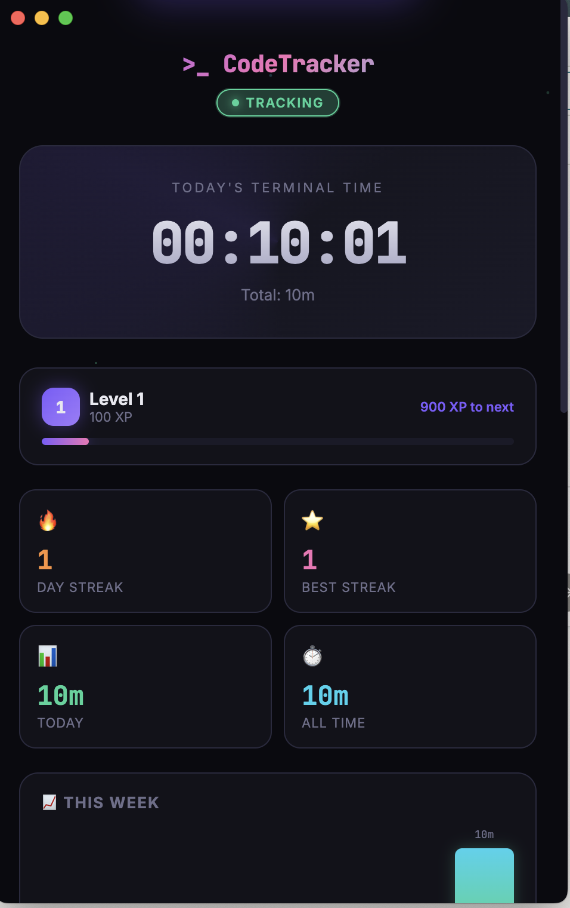
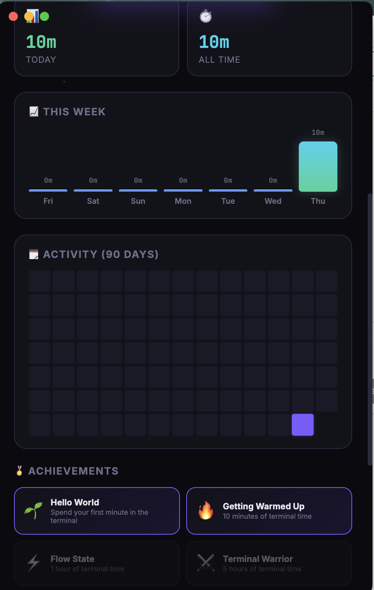

# >_ TerminalPulse

<p align="center">
  
  
</p>

A beautiful Mac desktop app that tracks your terminal time, detects AI coding tools, monitors projects, and rewards your grind with XP, levels, and achievements. 🚀

## ✨ Features

- **⏱️ Real-Time Tracking** — Automatically detects when your terminal is active (Terminal, iTerm2, Warp, Hyper, Alacritty, Kitty, WezTerm, Tabby)
- **🤖 AI Tool Detection** — Knows when you're using **Claude Code**, **Aider**, **GitHub Copilot**, **Cursor**, or **Continue** — tracks AI-assisted vs manual coding time
- **📂 Project Tracking** — Detects which git repos you're working in and how long you spend on each
- **🛠️ Dev Tool Monitoring** — Tracks usage of Node.js, Python, Docker, Git, Vim, SSH, Rust, Go, Ruby, Java and more
- **💻 Command History** — Shows your recent terminal commands in real time
- **📊 AI vs Manual Split** — Visual breakdown of how much of your coding is AI-assisted
- **📈 Weekly Chart** — Stacked bar chart showing AI vs manual time per day
- **🗓️ 90-Day Heatmap** — GitHub-style activity grid
- **🎮 XP & Leveling** — Earn 10 XP per minute. Level up every 1,000 XP
- **🔥 Streak Tracking** — Daily streak counter to keep you consistent
- **🏆 22 Achievements** — From "Hello World" (1 min) to "Vibe Coder" (50h AI time) — unlock them all
- **🔔 Toast Notifications** — Slick popup every time you unlock an achievement
- **📌 Menu Bar App** — Lives in your tray. Keeps tracking even when the window is closed
- **🚀 Launch at Login** — Starts automatically when your Mac boots up
- **💾 Persistent Data** — All stats saved locally. Survives restarts, sleep, and shutdowns
- **📝 Git Commit Counter** — Scans your repos and counts today's commits automatically

## 📦 Installation

### Prerequisites

- **macOS** (uses AppleScript for window detection)
- **Node.js** (v18 or later) — [Download here](https://nodejs.org/)

### Quick Install

```bash
# Clone the repo
git clone https://github.com/nitinms-ftw/TerminalPulse.git
cd TerminalPulse

# Install dependencies
npm install

# Build the app
npm run build:app

# Move to Applications
cp -R dist/mac-arm64/TerminalPulse.app /Applications/

# Launch it!
open /Applications/TerminalPulse.app
```

> **Apple Silicon (M1/M2/M3)?** The above works as-is.
> **Intel Mac?** The app will be in `dist/mac/TerminalPulse.app` instead.

### One-Liner

```bash
git clone https://github.com/nitinms-ftw/TerminalPulse.git && cd TerminalPulse && npm install && npm run build:app && cp -R dist/mac-*/TerminalPulse.app /Applications/ && open /Applications/TerminalPulse.app
```

### Dev Mode (no build)

```bash
git clone https://github.com/nitinms-ftw/TerminalPulse.git
cd TerminalPulse
npm install
npm start
```

## 🔐 Permissions

On first launch, macOS will ask for **Accessibility** permission to detect the active window:

**System Settings → Privacy & Security → Accessibility** → Toggle on **TerminalPulse**

## 🤖 Supported AI Tools

| Tool | Detection |
|------|-----------|
| Pi (Coding Agent) | `pi` process running |
| Claude Code | `claude` process running |
| Aider | `aider` process running |
| GitHub Copilot | `copilot` process running |
| Cursor | `cursor` process running |
| Continue | `continue` process running |

## 🏅 Achievements

| Icon | Title | Requirement |
|------|-------|-------------|
| 🌱 | Hello World | 1 minute of terminal time |
| 🔥 | Getting Warmed Up | 10 minutes |
| ⚡ | Flow State | 1 hour |
| ⚔️ | Terminal Warrior | 5 hours |
| 🥷 | Code Ninja | 10 hours |
| 🦸 | Full Day Hero | 24 hours total |
| 🏆 | Terminal Legend | 50 hours |
| 💎 | Centurion | 100 hours |
| 📅 | Consistent Coder | 3-day streak |
| 🗓️ | Week Warrior | 7-day streak |
| 🌟 | Monthly Master | 30-day streak |
| 🎮 | Leveling Up | Reach Level 5 |
| 🎯 | Double Digits | Reach Level 10 |
| 👑 | Quarter Century | Reach Level 25 |
| 🤖 | AI Apprentice | 1 minute with AI tools |
| 🧠 | Pair Programmer | 1 hour AI-assisted |
| 🔮 | AI Whisperer | 10 hours AI-assisted |
| 🎵 | Vibe Coder | 50 hours AI-assisted |
| 🚀 | Ship It | 10 git commits |
| ⚙️ | Commit Machine | 100 git commits |
| 📂 | Multi-Tasker | Work on 3 projects |
| 🏗️ | Portfolio Builder | Work on 10 projects |

## 🛠️ Tech Stack

- **Electron** — Desktop app framework
- **electron-store** — Persistent local storage
- **auto-launch** — Start at login
- **AppleScript** — Active window detection
- **ps aux** — Process monitoring for AI/dev tool detection
- **Git CLI** — Commit counting & project detection
- **Shell history** — Recent command tracking
- **Pure HTML/CSS/JS** — No frontend framework

## 🗂️ Project Structure

```
TerminalPulse/
├── main.js          # Main process (tracking, AI detection, projects, achievements)
├── preload.js       # Secure bridge between main & renderer
├── index.html       # UI (dashboard, charts, projects, tools, achievements)
├── package.json     # Dependencies & build config
├── screenshots/     # App screenshots
└── README.md
```

---

<p align="center">
  Built with ☕ and terminal time.<br>
  <strong>Track your grind. See your AI usage. Level up. Stay consistent.</strong>
</p>
